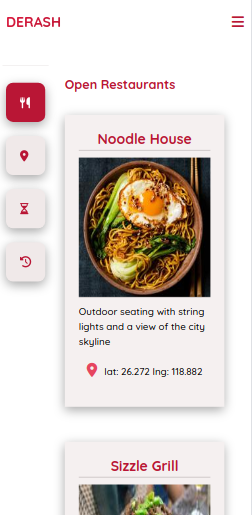
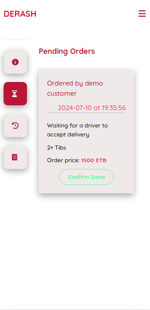

# Derash Food Delivery
A simplistic web application meant to connect food lovers, restaurant owners, and drivers in a single platform. This web app is mainly made of flask, with Jquery on the front-end
## Table of Contents
* [Introduction](#introduction)
* [Installation](#installation)
* [Usage](#usage)
* [Contributions](#contributions)
* [Related Projects](#related-projects)
* [Authors](#authors)
* [License](#license)
## Introduction
This web application is a project I built as the portfolio project for the end of the ALX SE Foundations Phase.

<a href="https://derash.zennoon.tech">Deployed site</a> 
<a href="https://www.linkedin.com/in/yunus-kedir">Author's Linkedin</a> 
<a href="https://medium.com/@yunus24kedir/derash-food-delivery-a64a22c5a3fe">Blog post</a> 

### Inspiration
The choice of Derash as my portfolio project was kind of a process of deductive reasoning. My first train of thought was that I wanted a project that could help me explore my interests as a developer and choose a specialization path (front-end or back-end). 

I knew I had more of a knack for building the back-end logic and/or database architecture, but I also really, ...really enjoy creating the front-end of an application if I have a specific design I adhere to. So, I wanted a project that could get me to touch upon all aspects of web-application development, from designing the models/objects, to user authentication, to testing, to deployment, and everything in between. So I chose to make a web-application

The next thought I had, was that I wanted a web-application that would involve multiple different types of users. This is because, one, I wanted to play around with authentication, and two, I wanted to build something somewhat complex enough to challenge me, so I can see where I am more capable.

Also, I had came upon a video in Youtube about the GoogleMaps API, and I wanted to apply that to a project.

From there, I had different ideas, including a <b id="clinic">Clinic management system</b>, a house rental registry application, and of course a food delivery application. 

I am a huge foodie, and I try to try out as many dishes as I can, not only in restaurants, but whenever I have time, I try to cook for my family, following recipes from Youtube. Most recently, I tried the Indian Biryani (I would give myself 1 out of 10 for execution, but I would 100% recommend). All these made the food delivery app a strong candidate. But the cherry on top was that I was thinking of a hypothetical name and the name <b>'Derash'</b> popped up. Besides the similarity to <b>DoorDash</b>, 'Derash' in my native tongue (Amharic) can be interpreted as <b>'someone who is quickly there for you when in need'</b>. So, I just thought 'I can't let this perfectly fitting name go to waste' and I chose the food delivery application as my project.

<!-- ## Technologies
                     -->

## Installation
You can find the deployed web application [here](https://derash.zennoon.tech)

If you want to play with your own version of Derash
* Clone the repository: `git clone https://www.github.com/Zennoon/Derash.git`
* Install python dependencies that are listed in [requirements.txt](./requirements.txt)
* Install MySQL client and create a derash_db database, and a derash_user user
* In the root directory of the project, execute the command  `DERASH_DB_PWD="$YOUR_PWD" python3 -m derash.run`

## Usage
This application was built to service three different types of users, as is typical of a lot of food delivery applications. These different users are described below

### Customer
A customer is a user that can browse the collection of restaurants, view a restaurant's info, and dishes, and order from a restaurant.

Once a customer has registered, they can view all the open restaurants, or they can filter open restaurants by location. 
     
   

They can click on a restaurant's card to view details about the restaurant, and also order if they wish. When ordering, they can specify the destination location by either entering coordinates, or using their location at the time of ordering. Once the order has been delivered, a customer is supposed to confirm the delivery

     
   

The application checks the distance between the restaurant's location, and the destination location submitted by the customer. If the distance is more than 10km (arbitrary choice), then the order is declined.

     
Otherwise, it is accepted. 
   

A customer can also leave a review for a restaurant, and view their pending, or past orders.

    

### Manager/Owner
A restaurant manager is someone who registers, one or more restaurants so they can receive orders from Derash customers.

Once a manager registers to derash, they can instantly start adding restaurants to manage. They can <b>activate/open</b> or <b>deactivate/close</b> their restaurants.

    

A manager can enter a restaurant's page to edit its details, add a new dish to the restaurant, or edit existing dishes. They can also view the reviews that have been made by customers.

    

If there are any pending orders, the restaurant manager can also view them.

    

The manager can also view a restaurant's past orders. Or, if the restaurant was created more than a month ago, they can view the past month's receipt.

### Driver
A driver is a user who accepts a request for delivery, and delivers the order from a restaurant to the ordering customer.

In Derash, drivers, like restaurants can can change their state to active, or dormant (not accepting deliveries).

    

While dormant, a driver won't be able to accept any delivery.

Drivers can also view any possible deliveries. The application filters all the pending orders based on the driver's current location, and only displays those where the distance between the driver, and the restaurant doesn't exceed 5km (arbitrary choice).

    

If a driver accepts a delivery, that delivery is moved to 'Pending Delivery' section. And a driver can only be delivering one order at a time, so the 'Possible Deliveries' section will now be empty so the driver can't accept another delivery.

    

Once the driver has delivered the order to the customer, they are expected to confirm the delivery.

To prevent fraudulent activity, Derash expects both the customer, and the driver to confirm delivery. If one of them still hasn't confirmed, then the order/delivery will still be visible in their 'Pending' section, and the driver won't be able to view possible deliveries.

    

## Contributions
I created this application so I can learn more about my craft,  and explore my interests. In the future, I intend to use this project to expand on this, and apply any new knowledge that I have gained to improve the application (actually, one of my short-term plans is to use React to try and make this a SPA). To this end, anyone and everyone who want to join me in learning, and applying, or who wishes to elevate this project, and improve it is welcome and appreciated.

## Related Projects
I am planning to work on that [Clinic Management system](#clinic) (which also gives patients some functionality) for my brother who has opened his own clinic recently. Will update this when I start.

## Authors
* Yunus Kedir Minuta: [Linkedin](https://www.linkedin.com/in/yunus-kedir), [X](https://x.com/ZennoonK)

## License
MIT licensed.
